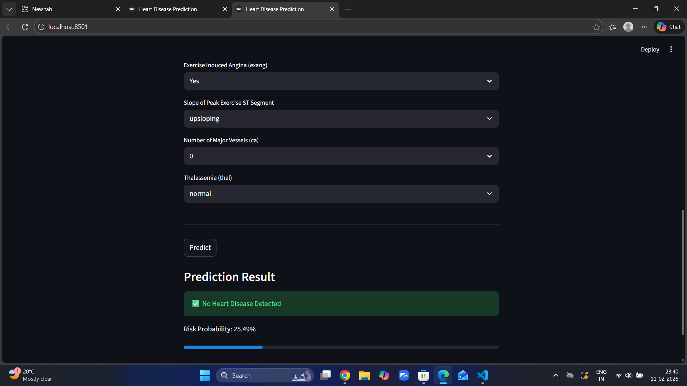

# Heart Disease Prediction using Machine Learning

## Project Overview
This project predicts whether a patient is likely to have heart disease based on clinical parameters.  
It is built using a complete Scikit-learn Pipeline and deployed as a Streamlit web application.

## Application Preview



## Live Demo
https://heart-disease-prediction-6grnbtjbvsgemvebbafs2y.streamlit.app/

## Tech Stack
- Python
- Pandas & NumPy
- Scikit-learn
- Streamlit
- Joblib
- Git & GitHub

## Features Used
- Age
- Sex
- Chest Pain Type
- Resting Blood Pressure
- Cholesterol
- Fasting Blood Sugar
- Resting ECG
- Maximum Heart Rate Achieved
- Exercise Induced Angina
- ST Depression (oldpeak)
- Slope
- Number of Major Vessels (ca)
- Thalassemia


## Model Details
- Implemented using Scikit-learn Pipeline
- Includes preprocessing + encoding + scaling
- Logistic Regression used for classification
- Evaluated using accuracy, confusion matrix


## Results
- Model Accuracy: ~79%
- Handles categorical and numerical features using pipeline architecture

## How to Run Locally

```bash
git clone https://github.com/sphurti14/heart-disease-prediction.git
cd heart-disease-prediction
pip install -r requirements.txt
streamlit run app.py
```